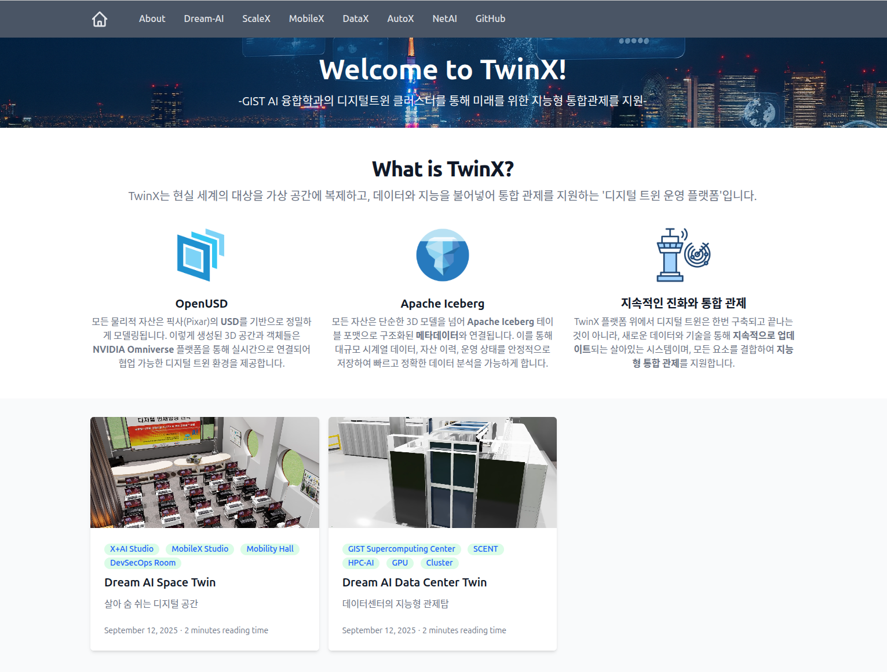
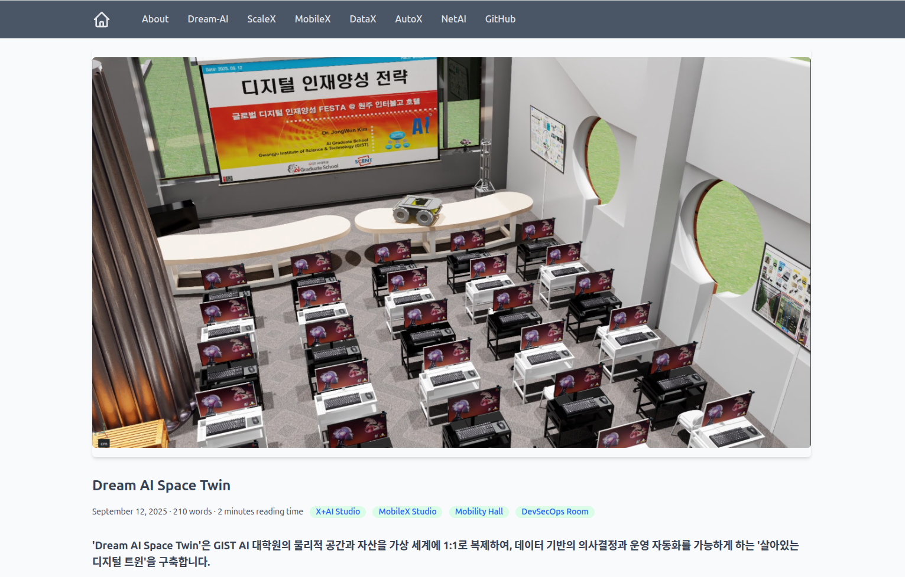
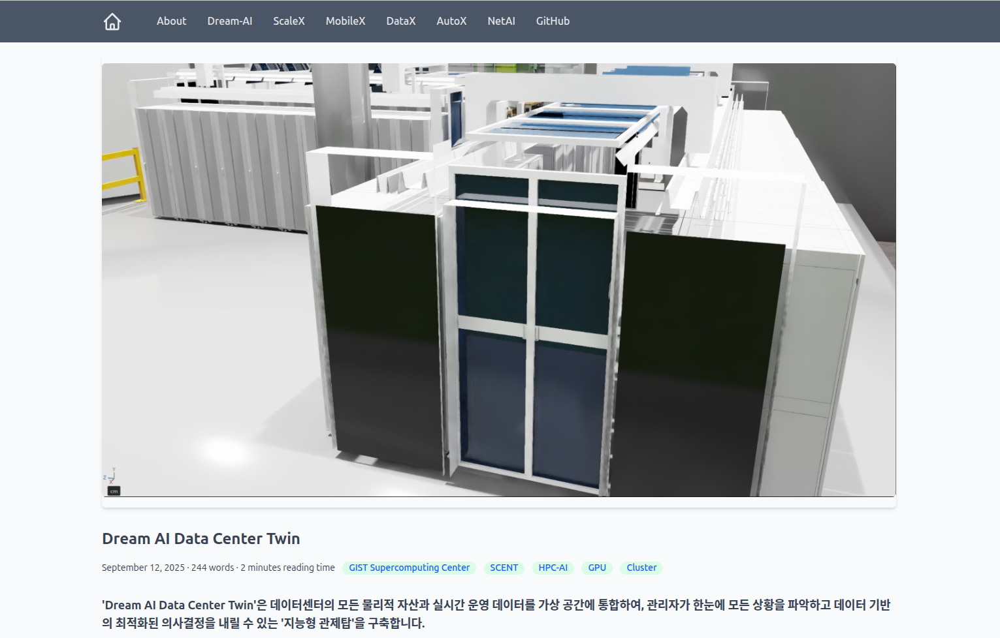
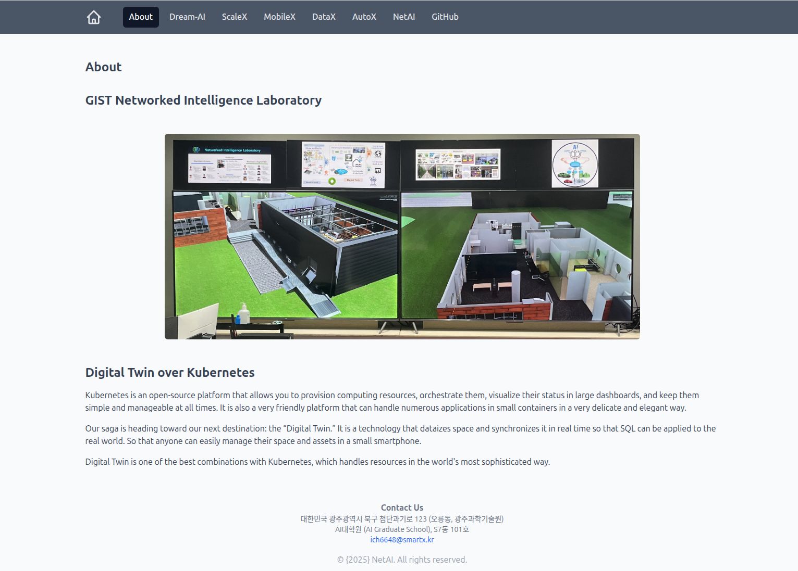

# TwinX-web

> **GIST AI 융합학과의 디지털 트윈 클러스터를 통해 미래를 위한 지능형 통합관제를 지원하는 플랫폼**

TwinX는 현실 세계의 대상을 가상 공간에 복제하고, 데이터와 지능을 불어넣어 통합 관제를 지원하는 '디지털 트윈 운영 플랫폼'입니다.

---

##  프로젝트 개요 (Overview)

TwinX 플랫폼은 현실의 물리적 자산과 가상의 데이터를 연결하여 실시간 제어와 최적의 의사결정을 지원합니다.

*   **OpenUSD:** Pixar의 USD를 기반으로 정밀한 3D 공간 및 객체 모델링 제공
*   **Apache Iceberg:** 대규모 시계열 데이터 및 자산 운영 상태의 체계적 관리
*   **지속적인 진화:** 실시간 데이터 연동을 통해 지속적으로 업데이트되는 지능형 관제 환경

---

##  주요 디지털 트윈 모듈

### 1. Dream AI Space Twin
GIST AI 대학원의 물리적 공간과 자산을 가상 세계에 1:1로 복제하여, 데이터 기반의 의사결정과 운영 자동화를 가능하게 하는 '살아있는 디지털 트윈' 공간을 구축합니다.

### 2. Dream AI Data Center Twin
데이터센터의 모든 물리적 자산과 실시간 운영 데이터를 가상 공간에 통합하여, 관리자가 한눈에 모든 상황을 파악하고 최적화된 의사결정을 내릴 수 있는 '지능형 관제탑'을 구축합니다.

---

##  Infrastructure: Digital Twin over Kubernetes

TwinX는 **Kubernetes** 인프라 위에서 구동됩니다. 컴퓨팅 리소스를 효율적으로 할당하고 대규모 대시보드 데이터를 안정적으로 처리하며, 현실 세계의 자산을 스마트폰이나 웹 브라우저를 통해 언제 어디서든 관리할 수 있는 환경을 제공합니다.

---

##  Contact Us

*   **주소:** 대한민국 광주광역시 북구 첨단과기로 123 (오룡동, 광주과학기술원) AI대학원 (AI Graduate School), S7동 101호
*   **이메일:** [ich6648@smartx.kr](mailto:ich6648@smartx.kr)
*   **소속:** GIST Networked Intelligence Laboratory

---
© 2026 **NetAI**. All rights reserved.
